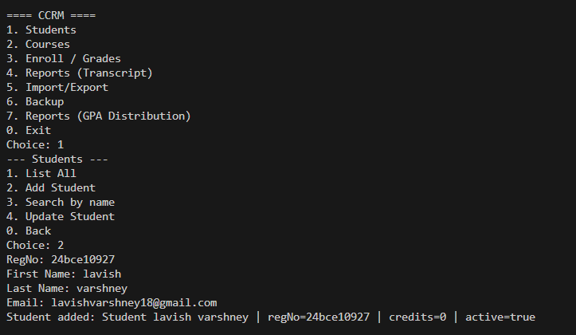

# Java Development Environment Setup Guide

## Evolution of Java: A Timeline

- **1995:** Java 1.0 - First release by Sun Microsystems
- **2004:** Java 5 - Major update with generics, enums, annotations
- **2014:** Java 8 - Revolutionary release with lambdas and Stream API
- **2018:** Java 11 - First LTS after Java 8, new HTTP client
- **2021:** Java 17 - Latest LTS with sealed classes
- **2023:** Java 21 - Virtual threads, pattern matching

## Java Editions Explained

| Feature | Java ME (Micro) | Java SE (Standard) | Java EE (Enterprise) |
|---------|----------------|-------------------|---------------------|
| Purpose | Embedded & Mobile | Desktop & Core | Large-Scale Apps |
| Device Target | IoT, Mobile | Personal Computers | Servers |
| API Size | Minimal | Complete Core | Extended Enterprise |
| Memory Usage | < 1MB | ~100MB | > 200MB |
| Common Uses | Smart Cards | Desktop Apps | Web Applications |
| Key APIs | CLDC, MIDP | Collections, IO | Servlets, EJB |

## Java Architecture

```
┌── Java Development Kit (JDK) ──────────┐
│   • Compiler (javac)                   │
│   • Debugger                           │
│   • Documentation                      │
│   ┌── Java Runtime Environment ───┐    │
│   │   • Class Libraries           │    │
│   │   • Development Tools         │    │
│   │   ┌── Java Virtual Machine ─┐ │    │
│   │   │   • Class Loader       │ │    │
│   │   │   • Bytecode Verifier  │ │    │
│   │   │   • Memory Manager     │ │    │
│   │   │   • Execution Engine   │ │    │
│   │   └─────────────────────────┘ │    │
│   └───────────────────────────────┘    │
└──────────────────────────────────────────┘
```

### Component Roles
- **JDK (Java Development Kit)**
  - Complete development package
  - Contains compiler (javac), debugger, docs
  - Includes JRE and development tools
  
- **JRE (Java Runtime Environment)**
  - Runtime environment for Java applications
  - Contains class libraries and JVM
  - Required to run Java programs
  
- **JVM (Java Virtual Machine)**
  - Executes Java bytecode
  - Manages memory and garbage collection
  - Platform-specific implementation

## Windows Installation Guide

### 1. Download and Install JDK

1. Visit [Oracle JDK Downloads](https://www.oracle.com/java/technologies/downloads/)
2. Download Windows x64 Installer
3. Run the installer and follow prompts


### 2. Configure Environment Variables

1. Open System Properties → Advanced → Environment Variables
2. Add new System Variable:
   ```
   Variable name: JAVA_HOME
   Value: C:\Program Files\Java\jdk-17
   ```
3. Edit Path variable, add:
   ```
   %JAVA_HOME%\bin
   ```

### 3. Verify Installation
Open Command Prompt and type:
```bash
java --version
javac --version
```



## Eclipse IDE Setup

### 1. Install Eclipse

1. Download [Eclipse IDE](https://www.eclipse.org/downloads/)
2. Run the installer
3. Select "Eclipse IDE for Java Developers"


### 2. Create New Java Project

1. File → New → Java Project
2. Configure project settings:
   - Project name: `MyJavaProject`
   - JDK version: Select installed JDK
   - Module settings: Don't create module
3. Click Finish


### 3. Configure Run Settings

1. Right-click project → Run As → Run Configurations
2. Create new Java Application configuration
3. Set Main class and other options


### 4. Project Structure
```
MyJavaProject/
├── src/
│   └── (your .java files)
├── bin/
│   └── (compiled .class files)
└── JRE System Library
```

## Tips for Success

1. **Environment Variables:**
   - Always verify JAVA_HOME is correctly set
   - Ensure Path includes JDK bin directory

2. **Eclipse Workspace:**
   - Choose a convenient workspace location
   - Use separate workspaces for different project types

3. **Project Organization:**
   - Follow package naming conventions
   - Keep source files organized in packages

4. **Common Issues:**
   - "java not recognized" → Check Path variable
   - "JDK not found" → Verify JAVA_HOME
   - Eclipse startup issues → Check workspace permissions

---
Additional screenshots available in the Screenshots folder can be used to further illustrate specific steps and features of the project.

[](https://ww## Syllabus Topic Mapping

| Topic | Implementation Location | Description |
|-------|------------------------|-------------|
| Classes & Objects | `src/Student.java` | Student class with encapsulation |
| Inheritance | `src/Person.java` | Base class for Student |
| Interfaces | `src/Printable.java` | Interface for printing objects |
| Collections | `src/StudentList.java` | ArrayList implementation |
| Exception Handling | `src/FileHandler.java` | Custom exceptions |
| File I/O | `src/DataManager.java` | File reading/writing |
| Threads | `src/AsyncTask.java` | Multi-threading example |
| Lambda Expressions | `src/Calculator.java` | Functional interfaces |
| Stream API | `src/DataProcessor.java` | Data streaming operations |

## Working with Assertions

### Enable Assertions
```bash
# Enable all assertions
java -ea MainClass

# Enable for package
java -ea:com.example... MainClass

# Enable for class
java -ea:com.example.MyClass MainClass
```

### Sample Assertion Usage
```java
// Value validation
assert score >= 0 : "Score cannot be negative";

// Object state check
assert !studentList.isEmpty() : "List must not be empty";

// Pre-condition check
assert age > 0 && age < 150 : "Invalid age: " + age;
```

### Running with Different Assertion Levels
```bash
# Run with all assertions
java -ea -cp bin MainClass

# Run with system assertions
java -esa -cp bin MainClass

# Disable assertions
java -da -cp bin MainClass
```va/technologies/downloads/)
[](https://opensource.org/licenses/MIT)

## Project Overview

This project demonstrates fundamental and advanced Java programming concepts through practical implementations. It serves as a comprehensive learning resource for Java programming, covering everything from basic syntax to advanced features.

### System Requirements & Setup
- **JDK Version:** Java Development Kit (JDK) 17 or higher
- **IDE:** Eclipse 2023-03 or later
- **Memory:** Minimum 4GB RAM
- **Storage:** 2GB free disk space

### Running the Project
```bash
# Compile Java files
javac -d bin src/*.java

# Run the main program
java -cp bin Main

# Run with assertions enabled
java -ea -cp bin Main
```

*A journey through Object-Oriented Programming with hands-on examples and real-world applications*

[🎯 Features](#features) • [🛠️ Installation](#installation) • [📚 Learning Path](#learning-path) • [🤝 Contributing](#contributing)

</div>

## Evolution of Java

Brief history of Java's major releases and their key features:

| Version | Year | Key Features |
|---------|------|--------------|
| Java 1.0 | 1995 | First release, Basic OOP |
| Java 1.1 | 1997 | Inner classes, JDBC, AWT |
| Java 1.2 | 1998 | Collections, Swing GUI |
| Java 5.0 | 2004 | Generics, Annotations, Autoboxing |
| Java 8 | 2014 | Lambda, Stream API, Optional |
| Java 11 | 2018 | HTTP Client, Local var syntax |
| Java 17 | 2021 | Sealed classes, Pattern Matching |
| Java 21 | 2023 | Virtual Threads, Record Patterns |

## Java Editions Comparison

| Feature | Java ME | Java SE | Java EE |
|---------|---------|----------|----------|
| Purpose | Mobile/Embedded | Desktop/Core | Enterprise Apps |
| Size | Compact (<1MB) | Medium (~100MB) | Large (>200MB) |
| APIs | Limited | Complete | Extended |
| Use Case | IoT, Mobile | Desktop Apps | Web Servers |
| UI | MIDP | Swing/JavaFX | Web-based |
| Database | RMS | JDBC | JPA/EJB |
| Security | Basic | Standard | Enterprise |
| Networking | Limited | Complete | Advanced |
| Examples | Smart Cards | Desktop Tools | Enterprise Systems |

<table>
<tr>
<td width="50%">

### 🏗️ Core Concepts
- Object-Oriented Programming
- Data Structures & Algorithms
- Exception Handling
- File I/O Operations
- Stream Processing

</td>
<td width="50%">

### 🛠️ Practical Applications
- Student Management System
- Course Registration
- Grade Processing
- Academic Transcripts
- Data Analytics

</td>
</tr>
</table>

## 💫 Quick Start

<details>
<summary>📦 Prerequisites</summary>

- Java Development Kit (JDK) 17+
- Eclipse IDE or IntelliJ IDEA
- Git (optional)
- 4GB RAM minimum

</details>

### 🚀 Installation Steps

```bash
# Clone this repository
git clone <your-repo-url>

# Navigate to project directory
cd java_project

# Compile the project
javac -d bin src/**/*.java

# Run the application
java -cp bin com.university.Main
```

## 📚 Learning Journey


### 🎓 Learning Modules

<table>
<tr>
<td>

#### 📘 Module 1: Fundamentals
- Variables & Data Types
- Control Structures
- Methods & Parameters
- Arrays & Collections

</td>
<td>

#### 📗 Module 2: OOP
- Classes & Objects
- Inheritance
- Polymorphism
- Encapsulation

</td>
</tr>
<tr>
<td>

#### 📙 Module 3: Advanced
- Exception Handling
- File Operations
- Multithreading
- Stream API

</td>
<td>

#### 📕 Module 4: Projects
- Student Management
- Grade Calculator
- File Processor
- Data Analyzer

</td>
</tr>
</table>

## 🌟 Code Showcase

<table>
<tr>
<td width="50%">

### 🎨 Object-Oriented Programming
```java
public class Student {
    private String name;
    private int age;
    
    public Student(String name, int age) {
        this.name = name;
        this.age = age;
    }
    
    public void study() {
        System.out.println(name + " is studying Java!");
    }
}
```

</td>
<td width="50%">

### 🔄 Modern Java Features
```java
List<Student> students = getStudents();
students.stream()
    .filter(s -> s.getAge() > 20)
    .map(Student::getName)
    .sorted()
    .forEach(System.out::println);
```

</td>
</tr>
</table>

## 🎮 Interactive Examples

<details>
<summary>💡 Basic Calculator</summary>

```java
public class Calculator {
    public static int add(int a, int b) {
        return a + b;
    }
    
    public static void main(String[] args) {
        System.out.println("5 + 3 = " + add(5, 3));
    }
}
```

</details>

<details>
<summary>🎲 Array Processing</summary>

```java
public class ArrayProcessor {
    public static double average(int[] numbers) {
        return Arrays.stream(numbers)
                    .average()
                    .orElse(0.0);
    }
}
```

</details>

## 🎯 Project Structure

```
java_project/
├── 📁 src/
│   ├── 📄 Main.java
│   ├── 📂 model/
│   │   ├── 📄 Student.java
│   │   └── 📄 Course.java
│   └── 📂 util/
│       └── 📄 Calculator.java
├── 📁 test/
│   └── 📄 TestSuite.java
├── 📁 resources/
│   └── 📄 config.properties
└── 📄 README.md
```

## 🚀 Advanced Features

<table>
<tr>
<td width="33%">

### 🔐 Security
- Input validation
- Error handling
- Secure file operations

</td>
<td width="33%">

### 📊 Data Processing
- Stream operations
- File handling
- Data structures

</td>
<td width="33%">

### 🔄 Optimization
- Memory management
- Performance tuning
- Code efficiency

</td>
</tr>
</table>

## 💻 Development Environment


- **JVM (Java Virtual Machine)**: Executes bytecode, manages memory, handles garbage collection
- **JRE (Java Runtime Environment)**: JVM + core libraries needed to run Java applications
- **JDK (Java Development Kit)**: JRE + development tools (compiler, debugger, documentation)

## 🤝 Contributing

We welcome contributions from the community! Here's how you can help:

<table>
<tr>
<td width="50%">

### 🔥 How to Contribute
1. Fork the repository
2. Create your feature branch
3. Commit your changes
4. Push to the branch
5. Open a Pull Request

</td>
<td width="50%">

### 🌟 Guidelines
- Write clean, documented code
- Follow Java naming conventions
- Add unit tests for new features
- Update documentation

</td>
</tr>
</table>

## 📬 Support & Contact

<div align="center">

Need help? Have questions? Want to contribute?

[](https://github.com/yourusername/java_project/issues)
[](https://github.com/yourusername/java_project/pulls)

[📧 Email Us](mailto:your.email@example.com) • [💬 Join Discord](https://discord.gg/your-server)

</div>

---

<div align="center">

### Made with ❤️ by the Java Community

*If you found this project helpful, please consider giving it a ⭐*

</div>

2. **Install JDK**
    - Run the installer as administrator
    - Follow installation wizard
    - Note installation path (e.g., `C:\Program Files\Java\jdk-17`)

3. **Set Environment Variables**
    - Open System Properties → Advanced → Environment Variables
    - Add `JAVA_HOME`: `C:\Program Files\Java\jdk-17`
    - Update `PATH`: Add `%JAVA_HOME%\bin`

4. **Verify Installation**
   ```bash
   java -version
   javac -version
   ```

   

### Eclipse IDE Setup

1. **Download Eclipse**
    - Visit [Eclipse Downloads](https://www.eclipse.org/downloads/)
    - Download Eclipse IDE for Java Developers

2. **Install and Configure**
    - Extract Eclipse to desired location
    - Launch Eclipse and select workspace
    - Go to Window → Preferences → Java → Installed JREs
    - Verify correct JDK is selected

3. **Create New Project**
    - File → New → Java Project
    - Enter project name: "CCRM"
    - Select JDK version (11+)
    - Configure build path if needed

   

4. **Import Existing Project**
    - File → Import → General → Existing Projects into Workspace
    - Browse to CCRM project folder
    - Select project and click Finish

   

## Project Structure & Syllabus Mapping

| Syllabus Topic | File/Class | Method/Concept | Description |
|----------------|------------|----------------|-------------|
| **Main Method & CLI** | `edu.ccrm.cli.MainMenu` | `main()`, `start()` | Application entry point, menu system |
| **Classes & Objects** | `edu.ccrm.domain.Student` | Constructor, getters/setters | Student entity with encapsulation |
| **Builder Pattern** | `edu.ccrm.domain.Course.Builder` | `code()`, `title()`, `build()` | Fluent API for object creation |
| **Enums** | `edu.ccrm.domain.Grade` | `S, A, B, C, D, F` | Grade enumeration with points |
| **Enums Advanced** | `edu.ccrm.domain.Semester` | `SPRING, FALL, SUMMER` | Semester enumeration |
| **Collections (List)** | `StudentService`, `CourseService` | `listAll()`, `ArrayList` | Student and course management |
| **Collections (Map)** | `MainMenu.showGpaDistribution()` | `HashMap<String, Double>` | GPA tracking and distribution |
| **Optional Class** | `StudentService.findByRegNo()` | `Optional<Student>` | Null-safe object handling |
| **Stream API** | `MainMenu.manageEnrollments()` | `filter()`, `toList()` | Filtering ungraded enrollments |
| **Stream Collectors** | `MainMenu.showGpaDistribution()` | `groupingBy()`, `counting()` | GPA distribution grouping |
| **Lambda Expressions** | `MainMenu.showGpaDistribution()` | `forEach()`, arrow functions | Functional programming |
| **Exception Handling** | `edu.ccrm.exceptions.*` | Try-catch blocks | Custom exceptions (DuplicateEnrollment) |
| **File I/O (NIO)** | `MainMenu.performBackup()` | `Files.copy()`, `DirectoryStream` | File operations and backup |
| **Recursion** | `edu.ccrm.util.RecursionUtil` | `calculateDirectorySize()` | Recursive directory traversal |
| **Configuration** | `edu.ccrm.config.AppConfig` | Singleton pattern | Application configuration |
| **Service Layer** | `edu.ccrm.service.*` | Business logic separation | Service-oriented architecture |
| **Switch Expressions** | `MainMenu.start()` | `case "1" ->` | Modern switch syntax (Java 14+) |
| **Record Classes** | `edu.ccrm.domain.Name` | Immutable data carriers | Modern Java record syntax |
| **Import/Export** | `edu.ccrm.io.ImportExportService` | CSV file processing | Data persistence |
| **Transcript Generation** | `edu.ccrm.service.TranscriptService` | `generateTranscript()` | Report generation |

## Running with Assertions

Assertions help validate program correctness during development:

### Enable Assertions
```bash
# Enable all assertions
java -ea edu.ccrm.cli.MainMenu

# Enable assertions for specific package
java -ea:edu.ccrm... edu.ccrm.cli.MainMenu

# Enable assertions for enrollment service
java -ea:edu.ccrm.service.EnrollmentService edu.ccrm.cli.MainMenu

# Disable assertions (default in production)
java -da edu.ccrm.cli.MainMenu
```

### Sample Assertion Commands
```bash
# Run CCRM with assertions enabled
java -ea -cp bin edu.ccrm.cli.MainMenu

# Run with system assertions and custom data folder
java -esa -ea -Ddata.folder=./test-data -cp bin edu.ccrm.cli.MainMenu

# Run with assertions for enrollment validation
java -ea:edu.ccrm.service.EnrollmentService -cp bin edu.ccrm.cli.MainMenu
```

### Assertion Examples in CCRM
```java
// Credit limit validation
assert totalCredits <= maxCredits : "Total credits exceed limit: " + totalCredits;

// Student registration validation
assert regNo != null && !regNo.isEmpty() : "Registration number cannot be empty";

// Grade point validation
assert grade.getPoints() >= 0.0 && grade.getPoints() <= 10.0 : "Invalid grade points";
```

## Application Features

### 1. Student Management
- **Add Students**: Register new students with RegNo, Name, and Email
- **List All Students**: Display complete student roster
- **Search by Name**: Find students using partial name matching
- **Update Student**: Modify student email addresses

### 2. Course Management
- **Add Courses**: Create courses with code, title, credits, and department
- **List All Courses**: View complete course catalog
- **Search/Filter**: Filter courses by department
- **Builder Pattern**: Uses Course.Builder for flexible object creation

### 3. Enrollment & Grading
- **Student Enrollment**: Enroll students in courses with validation
- **Credit Limit Checking**: Prevents over-enrollment based on max credits
- **Grade Assignment**: Assign grades (S/A/B/C/D/F) to enrolled students
- **Duplicate Prevention**: Prevents duplicate enrollment in same course

### 4. Reports & Analytics
- **Transcript Generation**: Complete academic transcript for students
- **GPA Distribution**: Statistical analysis of student performance
- **GPA Calculation**: Weighted GPA based on credits and grade points

### 5. Data Management
- **Import/Export**: CSV-based data import and export functionality
- **Backup System**: Automated backup with size calculation
- **Data Persistence**: File-based storage in configurable data folder


## Usage Guide

### Quick Start
```bash
# Clone/download CCRM project
git clone [your-repo-url]

# Compile all source files
javac -d bin -cp src src/edu/ccrm/cli/MainMenu.java

# Run CCRM application
java -cp bin edu.ccrm.cli.MainMenu
```

### Sample Commands & Operations
```bash
# Run with custom configuration
java -Ddata.folder=./custom-data -Dmax.credits=24 -cp bin edu.ccrm.cli.MainMenu

# Run with debug output
java -ea -verbose:gc -cp bin edu.ccrm.cli.MainMenu

# Generate transcript for specific student
# (Use option 4 in menu, then enter RegNo)

# Perform system backup
# (Use option 6 in menu - creates timestamped backup folder)
```

### Test Data Files Structure
```
test-data/
├── students.csv          # Sample student records (RegNo, FirstName, LastName, Email)
├── courses.csv           # Course catalog (Code, Title, Credits, Department, Semester)
├── enrollments.csv       # Enrollment data (StudentRegNo, CourseCode, Grade)
└── config.properties     # Application configuration settings
```

### Sample CSV Formats

**students.csv:**
```csv
RegNo,FirstName,LastName,Email
CS001,John,Doe,john.doe@university.edu
CS002,Jane,Smith,jane.smith@university.edu
CS003,Bob,Johnson,bob.johnson@university.edu
```

**courses.csv:**
```csv
Code,Title,Credits,Department,Semester
CS101,Programming Fundamentals,4,Computer Science,SPRING
CS102,Data Structures,4,Computer Science,FALL
MATH201,Calculus I,3,Mathematics,SPRING
```


